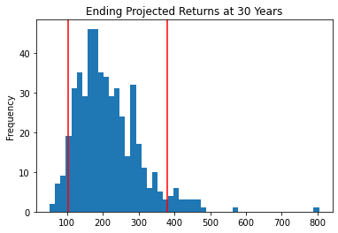
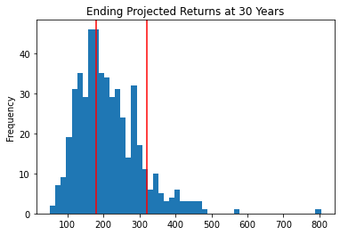
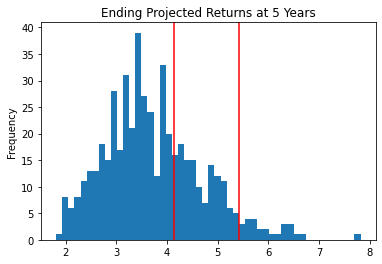

# Financial Report

## **Budget Analysis**

From looking at this individual, we can conclude that they are spending far above their means. They are making $500 a month, with a projected yearly income of $6,085

Their spending habits are crazy! From the data I pulled, we can see that they are spending over $10,000 each month. Represented by the chart below. Please note April is low due to not pulling in all the transactions in April, I only pulled in the data from the past 90 days.

 I've also compiled a pie chart below detailing their spending habits over the past 90 days. We can see this individual is transfering a lot of money somewhere.

 

 In conclusion, this individual is making only $500 dollars a month with a history of spending over $10,000 each month. Yet somehow he is still surviving, my recommendation would be to report him to the IRS as I suspect there's some money laudering here with the high transaction rates he has.

## **Retirement Planning**

Below you will see a Monte Carlo simulation of our prefered portfolio, containing SPY and AGG, ran for 30 years. 

Also at the end of the 30 years, if you decide to withdraw 4%, we're confident that each month your retirement income will exceed $500.

So customer, are you ready to invest with us and get rich over the next 30 years?

### **20 Years**
(The starter code had 20 years listed)

I'm 90% confident that you're expected returns will fall between 19.74 and 56.89 times your initial investment. As demonstrated by the chart below.  

However I'm also 50% confidence your expected returns will be between 27.13 and 41.75 times your initial investment. As demonstrated by the chart below.

### **30 Years**

I'm 90% confident that you're expected returns will fall between 102.83 and 379.34 times your initial investment. As demonstrated by the chart below.  

However I'm also 50% confidence your expected returns will be between 179.25 and 320.56 times your initial investment. As demonstrated by the chart below.

## **Retirement Analysis**

1. What are the expected cumulative returns at `30` years for the `10th`, `50th`, and `90th` percentiles?

        At 30 years, the 10th percentile of your expected returns is 119.03% of your initial investment

        At 30 years, the 50th percentile of your expected returns is 199.08% of your initial investment

        At 30 years, the 90th percentile of your expected returns is 320.56% of your initial investment
    

2. Given an initial investment of `$20,000`, what is the expected return in dollars at the `10th`, `50th`, and `90th` percentiles?

        At 30 years, you can expect $2380549.70 at the 10th percentile.

        At 30 years, you can expect $3981677.14 at the 50th percentile.

        At 30 years, you can expect $6411230.97 at the 90th percentile.
    

3. Given the current projected annual income from the Plaid analysis, will a `4%` withdrawal rate meet or exceed that value at the `10th` percentile? Note: This is basically determining if retirement income is equivalent to current income.

        Yes    

4. How would a `50%` increase in the initial investment amount affect the `4%` retirement withdrawal? In other words, what happens if the initial investment had been bigger?

        The increase in initial investment would only increase your retirement income after 30 years, assuming market condidtions don't drastically change. 
    
    
## **Optional Challenge**
    

To retire within 5 years, it is advised that your portfolio contain only stocks, assuming a normal market. Also having an initial investment of $500,000 would help out. However if you only have an initial investment of $250,000, I'm 25% confident that you'll be able to quadraple that amount in 5 years. As evident from the graph below. 

