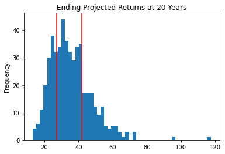

# Financial Report

## **Budget Analysis**

From looking at this individual, we can conclude that they are spending far above their means. They are making $500 a month, with a projected yearly income of $6,085

Their spending habits are crazy! From the data I pulled, we can see that they are spending over $10,000 each month. Represented by the chart below. Please note April is low due to not pulling in all the transactions in April, I only pulled in the data from the past 90 days.

 I've also compiled a pie chart below detailing their spending habits over the past 90 days. We can see this individual is transfering a lot of money somewhere.

 

 In conclusion, this individual is making only $500 dollars a month with a history of spending over $10,000 each month. Yet somehow he is still surviving, my recommendation would be to report him to the IRS as I suspect there's some money laudering here with the high transaction rates he has.

## **Retirement Planning**

Below you will see a Monte Carlo simulation of our prefered portfolio, containing SPY and AGG, ran for 30 years. 

I'm also 90 % confident that you're expected returns will fall between 19.735732 and 56.886259 times your initial investment. As demonstrated by the chart below. 

However if you invest with us, I'm 50% confidence your expected returns will be between 27.132614 and 41.75131 times your initial investment. As demonstrated by the chart below.

Also at the end of the 30 years, and you decide to withdraw 4%, we're confident that each month your retirement income will exceed $500.

So customer, are you ready to invest with us and get rich over the next 30 years?